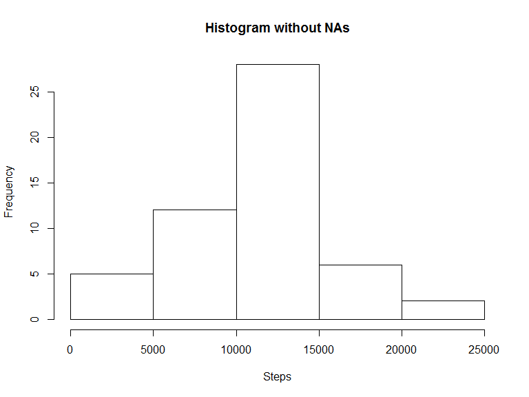
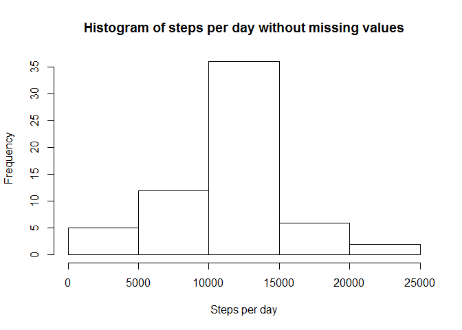
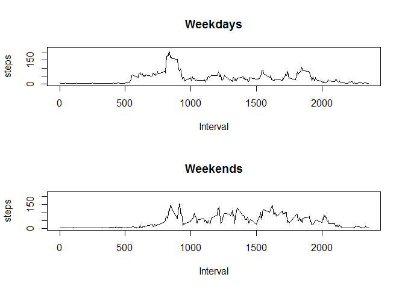

First Assignment
=============================

This is the first assignment for Reproducible Research.
date: july 9th 2016

### Read data

First the data must be read.


Then, the data must be processed. In this case, the rows with NAs in the steps column were eliminated.

```r
data2 <- na.omit(data1)
```

### Histogram for Number of steps for each day

The steps for each day must be summed.
Then a histogram is drawn.


```r
stepsperday <- tapply(data2$steps, data2$"date", sum)
hist(stepsperday, xlab= "Steps", main="Histogram without NAs")
```

<!-- -->

###Average daily activity pattern
The mean and the median of the steps per dey are:

```r
meansteps <- mean(stepsperday, na.rm = TRUE)
mean(stepsperday, na.rm = TRUE)
```

```
## [1] 10766.19
```

```r
mediansteps <- median(stepsperday, na.rm=TRUE)
median(stepsperday, na.rm=TRUE)
```

```
## [1] 10765
```


### Average interval with highest number of steps

The time series for each interval is calculated and then plotted.

```r
stepsinterval <- tapply(data2$steps, data2$"interval", mean)
        plot(stepsinterval, type="l", xlab="Interval", ylab="Average Number of Steps")
```

<!-- -->

```r
        which.max(stepsinterval)
```

```
## 835 
## 104
```

```r
        stepsinterval[104]
```

```
##      835 
## 206.1698
```
Therefore, the interval with the highest average number of steps is 104.


### Input of the missing data

The missing data will be substituted by the average number of steps by interval.

First another dataframe is created and then the missing values are substituted by the mean.

```r
        data3 <- data1
        meanbyinterval <- mean(stepsinterval)
data3$steps[which(is.na(data3$steps))]<-meanbyinterval
```

With this new data, the new histogram is:

```r
newstepsperday <- tapply(data3$steps, data3$"date", sum)
head(newstepsperday)
```

```
## 2012-10-01 2012-10-02 2012-10-03 2012-10-04 2012-10-05 2012-10-06 
##   10766.19     126.00   11352.00   12116.00   13294.00   15420.00
```

```r
hist(newstepsperday, xlab="Steps per day", main="Histogram of steps per day without missing values")
```

<!-- -->


### Differences between  weekdays and weekends.

First a new dataset is created. Then a new column is created. The data is separated between weekdays and weekends. Then the analysis is performed.


```r
data4 <- data3
data4$week <- weekdays(as.Date(data4$"date"))

datawkd1 <- subset(data4, data4$week == "lunes")
datawkd2 <- subset(data4, data4$week == "martes")
datawkd3 <- subset(data4, data4$week == "miércoles")
datawkd4 <- subset(data4, data4$week == "jueves")
datawkd5 <- subset(data4, data4$week == "viernes")
datawkd6 <- subset(data4, data4$week == "sábado")
datawkd7 <- subset(data4, data4$week == "domingo")

datawkd <- rbind(datawkd1,datawkd2, datawkd3, datawkd4, datawkd5)
datawknd <- rbind(datawkd6, datawkd7)
datawkd$Day <- "Weekday"
datawknd$Day <- "Weekend"

daydata <- rbind(datawkd, datawknd)
fulldata <- tapply(daydata$steps, list(daydata$"interval", daydata$Day), mean)
int <- rownames(fulldata)
```

 Getting the mean steps by weekday or weekend. First two lists.

```r
stepsinterwd <- tapply(datawkd$steps, datawkd$"interval", mean)
stepsinterwd <- as.data.frame(stepsinterwd)
stepsinterwd$Day <- "Weekday"
stepsinterwd$Interval <- as.numeric(int)
colnames(stepsinterwd) <- c("steps", "Day", "Interval")

stepsintwkd <- tapply(datawknd$steps, datawknd$"interval", mean)
stepsintwkd <- as.data.frame(stepsintwkd)
stepsintwkd$Day <- "Weekend"
stepsintwkd$Interval <- as.numeric(int)
colnames(stepsintwkd) <- c("steps", "Day", "Interval")
```
Making the plots.

```r
par(mfrow=c(2,1))
with(stepsinterwd, plot(Interval, steps, main ="Weekdays", type = "l", ylim=c(0,220)))
with(stepsintwkd, plot(Interval, steps, main ="Weekends", type="l", ylim=c(0,220)))
```

<!-- -->


Therefore, according to this data, people walk more on weekdays than on weekends.
